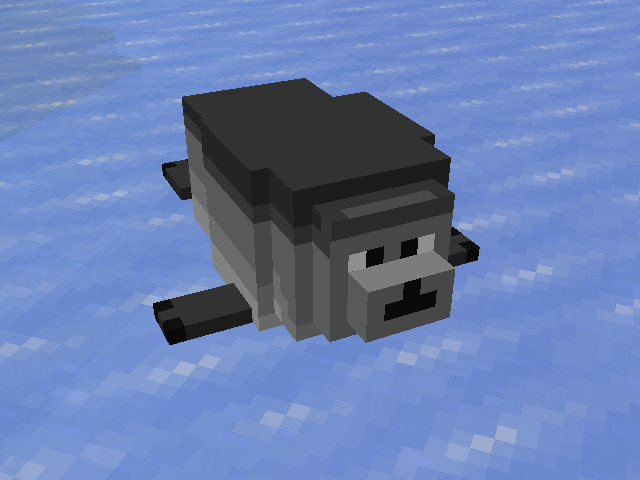
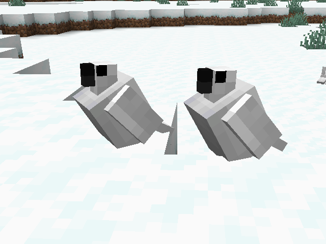
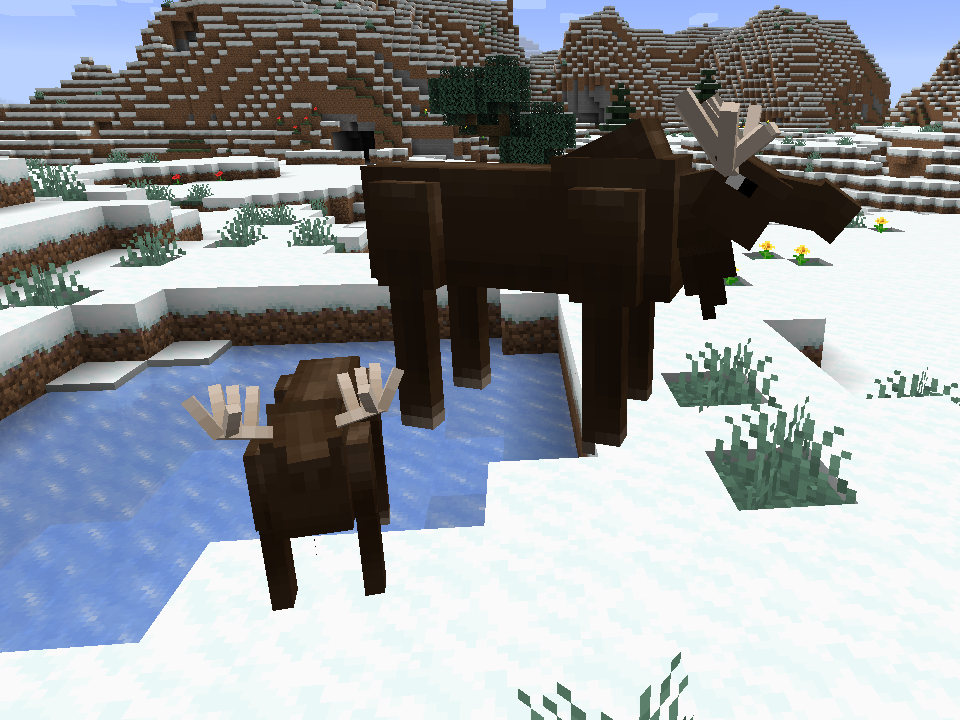
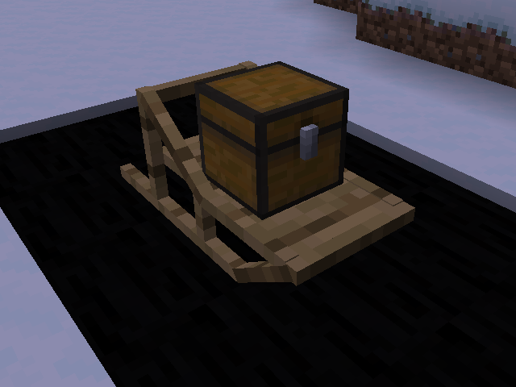
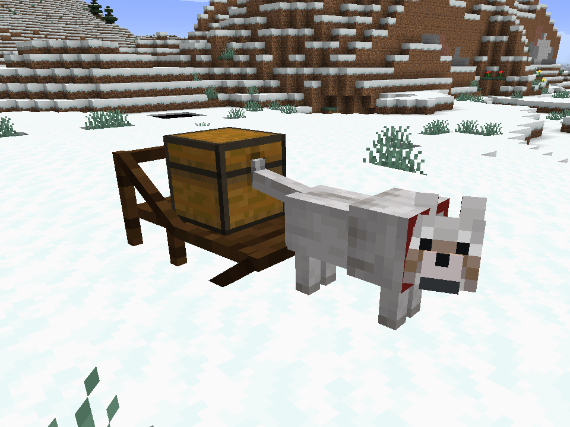
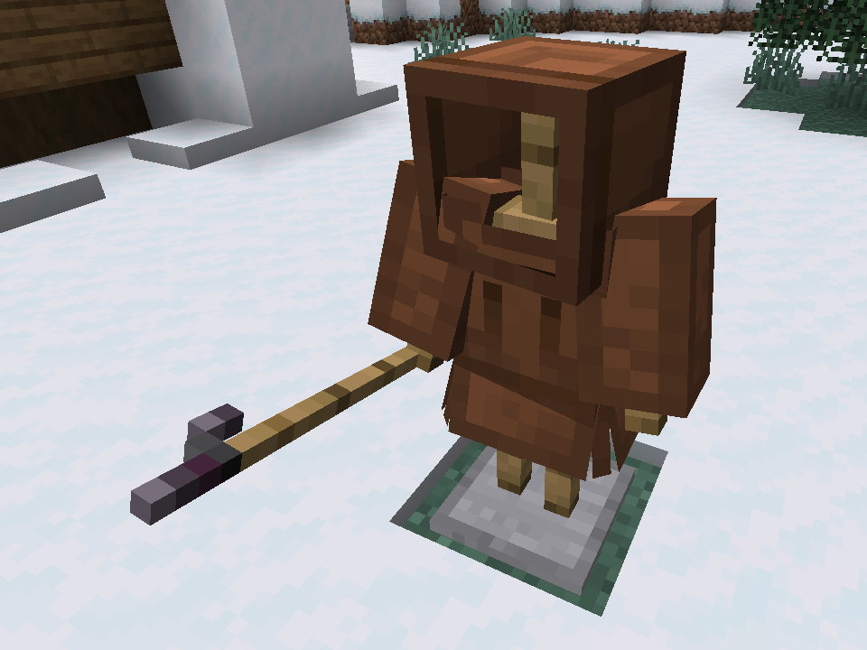
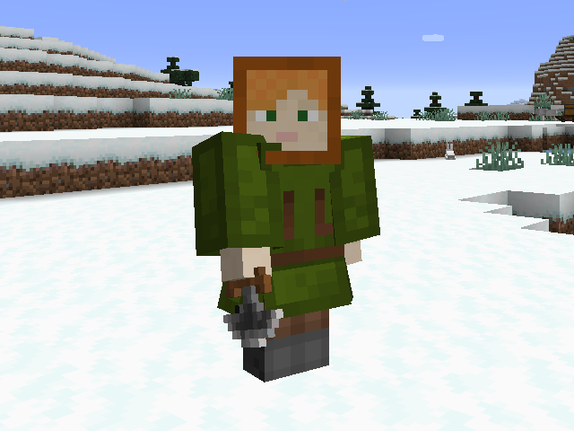

# Alaska Native Craft
## About
This mod aims to bring various aspects of Alaska Native cultures to Minecraft!\
Currently included features are described below.

## Features
1. Mobs
    * Harp Seals
      * These fellas spawn in ocean and river biomes and spend their time hunting fish
    * Ptarmigans
      * These guys can be tamed with seeds and rides your shoulder much like a parrot!
    * Moose
      * Moose are the largest members of the deer family and can be found occasionally wandering the colder biomes.\
        If you've got a good eye, you may even track them down by following the trail of stripped logs they leave in their wake!
1. Dogsleds
    * Dogsleds are the best way to travel across the frozen tundra. Just harness up your favorite dog and get to mushing!
    * A good thing to pay attention to is that dogsleds are much faster on snow and ice.
1. Harpoons
    * Tired of having to run up to mobs to leash them? Or maybe you just don't want to have to grind for that pesky trident.
    If so, this product's for you!
1. Kuspuks
    * These traditional Alaska Native clothes are both stylish and comfortable. These outfits are here for decoration purposes only (for now).
1. Ulu
    * Like shears, these guys are great for everything shears are good for, but they don't fill your inventory with leaf blocks.
    
## Screenshots

## Art Credit

Huge thanks to these artists for the textures they've provided! \
- Daimons for the moose
- Kazoo for the cloudberries, raspberries, and salmonberries